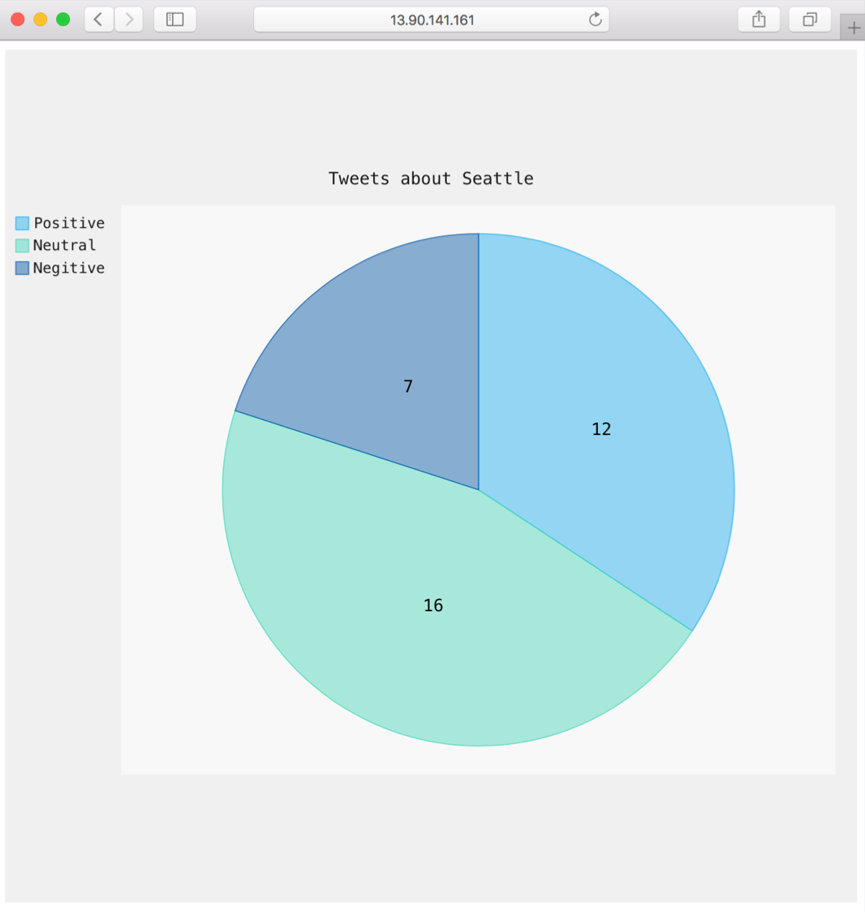

# Twitter Sentiment to Cosmos DB

### [Get Tweets](../../tree/master/twitter-sentiment-apps/get-tweet)

Collects tweets based on a key word and stores these in an Azure Queue.

### [Process Tweets](../../tree/master/twitter-sentiment-apps/process-tweet)

Get Tweets from Azure Queue, performs sentiment analysis using Azure Analytics, and stores the results in Cosmos DB.

### [Chart Tweets](../../tree/master/twitter-sentiment-apps/chart-tweet)

Creates a pie chart with tweet sentiment results.

# Videos

[Application Demo](https://youtu.be/qJpv-TwW3w0)

[Application Quickstart](https://youtu.be/v-RobmRUdFg)

[Manual and Auto Scale](http://www.youtube.com/watch?v=J1a4fTb2grg)

Kubernetes Custom Resource Definition (CRD) - comming soon

Kubernetes postStop Hook - comming soon

# Prerequisites

### Kubernetes Cluster 

You will need a Kubernetes cluster before running the Twitter Sentiment to Cosmos DB application. 

To create a Kubernetes cluster in Azure Container Service, see [ACS Kubernetes Quick Start](https://docs.microsoft.com/en-us/azure/container-service/kubernetes/container-service-kubernetes-walkthrough).

### Twitter Application

You also need a registered Twittered application, which can be created at [https://apps.twitter.com]( https://apps.twitter.com).

From this application, you need the following items:

- TWITTER_CONSUMER_KEY
- TWITTER_CONSUMER_SECRET
- TWITTER_ACCESS_TOKEN
- TWITTER_ACCESS_TOKEN_SECRET

### Azure Subscription and CLI

You will need an Azure Subscription and the Azure CLI. 

[Free Azure Trial](https://azure.microsoft.com/en-us/free/?v=17.16&WT.srch=1&WT.mc_id=AID559320_SEM_BXZWtUPg&gclid=CjwKCAjwuITNBRBFEiwA9N9YEEvI-py5W2k4RXJcjHj_GCshHPGDY5DhdrHn3gyd6uXbtJ-7iHsjphoCJr0QAvD_BwE)
[Azure CLI Installation](https://docs.microsoft.com/en-us/cli/azure/install-azure-cli)

# Quick Start

## Deploy Azure resources and create Kubernetes manifest file

Copy the `build-twitter-sentiment.sh` script to your development machine. The script can be founder [here](./demo-creation-script/build-twitter-sentiment.sh).

Update the script with your Twitter application information and the text that you want use to filter returned tweets. 

```
# Twitter API Endpoint and Credentials - this is not automated so must be specified.
TWITTER_CONSUMER_KEY=replace
TWITTER_CONSUMER_SECRET=replace
TWITTER_ACCESS_TOKEN=replace
TWITTER_ACCESS_TOKEN_SECRET=replace

# Twitter search term - used to filter returned tweets.
TWITTER_TEXT=Seattle
```

Once complete, run the script.

```
sh twitter-sentiment.sh
```

## Run the Application

The included script not only creates the required Azure resource, it also creates pre-populated Kubernetes manifest files that can be used to start the application. The manifest file is located in the directory from which the script was run.

Note – the Azure secrets are not secured in a Kubernetes secret.

Run the manifest file.

```
kubectl create -f twitter-sentiment.yml
```

Output:

```
deployment "process-tweet" created
deployment "get-tweet" created
deployment "chart-tweet" created
service "chart-tweet" created
```

The Chart Tweet service can take some time to complete. To watch progress, run the following.

```
kubectl get service -w
```

Once a public IP address has been return browse to this IP address to see the retuned sentiment results.



## Caution

Once the application starts, tweets are immediately captured, stored in the Azure Queue, and processed. While the application is running, it will incur an Azure cost. As the number of returned tweets increases, so does the Azure spend.

