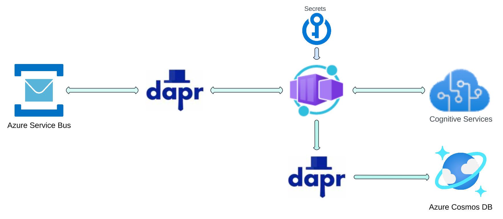

# Twitter Sentiment engine

Collects tweets, gets sentiments of tweets, stores, and visualizes results.

#### Get Tweets

#### Process Tweets

#### Chart Tweets

## Prerequisites

You will need a Twitter account and credentials for authentication with Twitter APIs. You can sign up for a Twitter developer account at https://developer.twitter.com/ .

- TWITTER_CONSUMER_KEY
- TWITTER_CONSUMER_SECRET
- TWITTER_ACCESS_TOKEN
- TWITTER_ACCESS_TOKEN_SECRET

You also need an Azure account, the Azure CLI installed and authenticated, and a pre-created Kubernetes cluster.

## Quickstarts

This solution works locally (with Azure backend), in Azure Container Apps, and Kubernetes. Steps for eaach deployment option can be found in the following documents.

- [Quickstart Local Execution](./docs/quickstart-local.md)
- [Quickstart Azure Container Apps](./docs/quickstart-azure-container-apps.md)
- [Quickstart Kubernetes](./docs/quickstart-kubernetes.md)